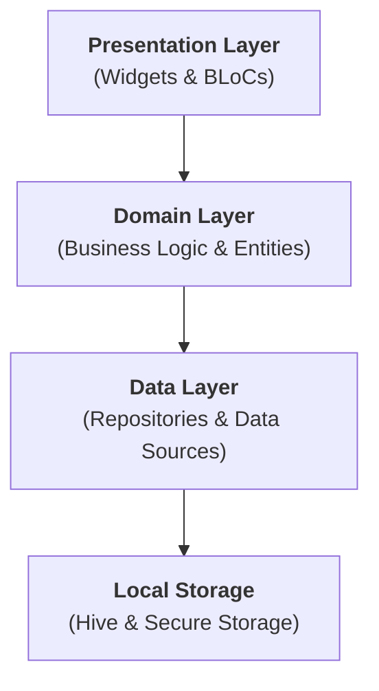

# 🌲 Offline Survival Companion

> **Your ultimate digital lifeline for off-grid survival, emergency preparedness, and secure data storage.**

---

## 📱 Project Overview

The **Offline Survival Companion** is a robust, offline-first mobile application designed to function as a critical toolset when internet connectivity is unavailable. Whether you're hiking in the wilderness, facing a natural disaster, or simply traveling off-grid, this app ensures you have access to vital maps, guides, tools, and encrypted documents.

### Key Features
- **🌍 Smart Offline Maps:** Download and manage vector map packs for completely offline navigation.
- **🚨 Emergency SOS:** One-tap activation of a loud alarm, strobe light, and location sharing.
- **🔒 Secure Vault:** AES-256 encrypted storage for sensitive documents (passports, IDs) protected by biometrics.
- **📚 Survival Guide:** Pre-loaded, comprehensive guides for first aid, shelter building, and fire starting.
- **🔦 Quick Tools:** Integrated flashlight, compass, and battery monitoring.

---

## 🛠️ Technology Stack

Built with modern, industry-standard technologies to ensure reliability, performance, and security.

### Core Framework
- **Flutter (Dart):** For cross-platform (iOS/Android) native performance from a single codebase.

### State Management & Architecture
- **BLoC (Business Logic Component):** Ensures a clear separation of concerns, testability, and predictable state management.
- **Clean Architecture:** Divided into strict layers:
  - `Presentation`: UI and State Management (BLoC).
  - `Domain`: Business Logic, Use Cases, and Entities (Pure Dart).
  - `Data`: Repositories, Data Sources, and Models.

### Local Data & Storage
- **Hive:** High-performance, NoSQL local database for storing user preferences and metadata.
- **Flutter Secure Storage:** Keychain/Keystore abstraction for storing sensitive encryption keys.

### Security
- **AES-256 Encryption:** Military-grade encryption for all files in the Vault.
- **Local Auth:** Biometric authentication (FaceID/TouchID) integration.

### Maps & Location
- **Flutter Map:** Versatile open-source map rendering.
- **Geolocator:** Precise device location tracking.
- **Vector Map Tiles:** Efficient, lightweight map data format for offline usage.

---

### System Architecture

The application is built using a strict **Clean Architecture** pattern, ensuring the codebase is scalable, maintainable, and independent of external frameworks.



#### Layer Responsibilities:
- **Presentation Layer**: Handles UI rendering and state management using the BLoC pattern.
- **Domain Layer**: The core of the application, containing pure Dart business logic and entity definitions.
- **Data Layer**: Manages data flow from local databases (Hive) and secure hardware storage.


### Folder Structure
```
lib/
├── core/               # Shared utilities, constants, theme, and errors
├── data/               # Data sources, models, and repositories implementations
├── domain/             # Entities, repositories interfaces, and use cases
├── presentation/       # UI Screens, Widgets, and BLoC
└── main.dart           # App entry point and dependency injection
```

---

## 🚀 Getting Started

### Prerequisites
- Flutter SDK (latest stable)
- Xcode (for iOS) or Android Studio (for Android)
- CocoaPods (for iOS dependencies)

### Installation
1. **Clone the repository:**
   ```bash
   git clone https://github.com/yourusername/offline-survival-companion.git
   ```
2. **Install dependencies:**
   ```bash
   flutter pub get
   ```
3. **Run the app:**
   - **iOS Simulator:** `open -a Simulator && flutter run`
   - **Android Emulator:** `flutter emulators --launch <emulator_id> && flutter run`

---

## 🧪 Testing

The project emphasizes reliability through rigorous testing strategies:
- **Unit Tests:** Verify individual functions and business logic.
- **Widget Tests:** Ensure UI components render and behave correctly.
- **Integration Tests:** End-to-End (E2E) tests simulating real user flows on a simulator/device.

Run integration tests:
```bash
flutter test integration_test/app_test.dart
```

---

## 🤝 Contributing
Contributions are welcome! Please fork the repository and submit a pull request with your improvements.

## 📄 License
This project is licensed under the MIT License - see the LICENSE file for details.
