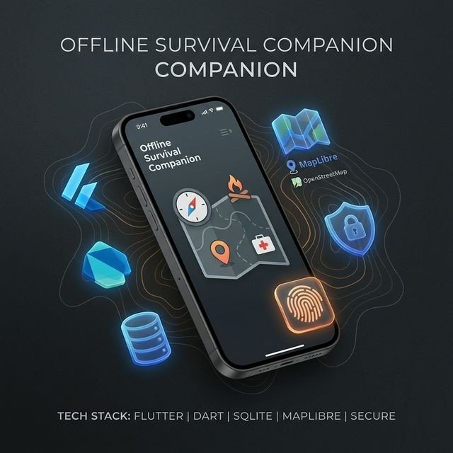
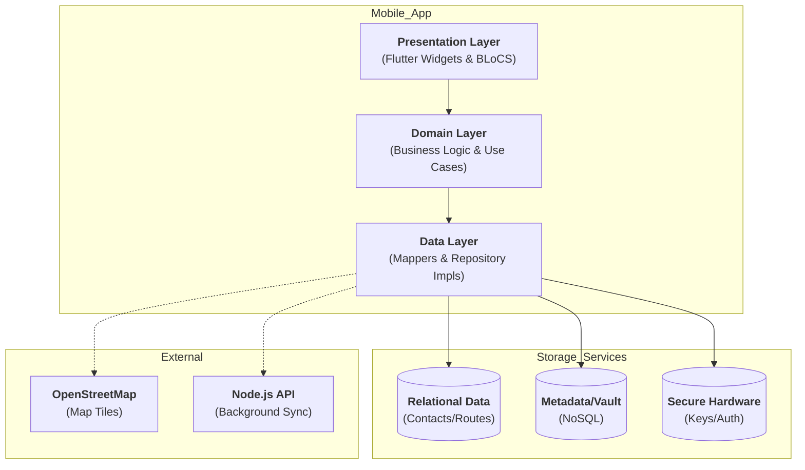

# 🌲 Offline Survival Companion



> **Your ultimate digital lifeline for off-grid survival, emergency preparedness, and secure data storage.**

The **Offline Survival Companion** is a robust, offline-first mobile application designed to function as a critical toolset when internet connectivity is unavailable. Whether you're hiking in the wilderness, facing a natural disaster, or simply traveling off-grid, this app ensures you have access to vital maps, guides, tools, and encrypted documents.

---

## 📱 Key Features

### 🌍 Advanced Offline Mapping
- **Vector Map Engine:** High-performance MapLibre GL integration for smooth offline rendering.
- **Regional Downloads:** Optimized map pack management for specific geographic areas.
- **Topographic Mode:** Enhanced terrain visualization with elevation-focused overlays.
- **Safety Markers:** Real-time visibility of Police Stations, Hospitals, and Survival Points.
- **Route Tracking:** Record and save your off-grid paths even without network.

### 🚨 Emergency & SOS
- **Silent SOS:** Discreet panic button to trigger emergency procedures.
- **Loud Alarm:** High-decibel siren to attract attention in critical situations.
- **SOS Contacts:** Automated status updates and location sharing with trusted emergency contacts.
- **Dynamic Monitoring:** Real-time battery and sensor tracking during active SOS events.

### 🛡️ Women's Safety & Empowerment
- **Fake Call:** Schedule realistic incoming calls to exit uncomfortable situations.
- **Safety Timer:** Automated SOS trigger if not deactivated within a set timeframe.
- **Helpline Directory:** Instant access to women-specific emergency services.
- **Self Defense:** Illustrated guides for physical safety and empowerment.

### 🔒 Secure Data Vault
- **AES-256 Encryption:** Military-grade protection for sensitive documents.
- **Biometric Lock:** Secure access via Fingerprint or FaceID.
- **Offline Storage:** Everything is stored locally on-device, never touching the cloud.

### 🎒 Survival Toolkit
- **AR Compass:** Augmented reality navigation for precise heading.
- **Webpage Saver:** Save critical survival articles or news for offline reading.
- **QR Vault:** Scan and store vital contact info or medical data securely.
- **Signal Tools:** Flashlight, SOS strobe, and signal mirror simulators.

---

## 🛠️ Technology Stack

| Category | Technology |
| :--- | :--- |
| **Framework** | Flutter (Dart) |
| **State Management** | BLoC (Business Logic Component) |
| **Local Database** | SQLite (sqflite) & Hive |
| **Navigation** | GoRouter |
| **Mapping** | MapLibre GL |
| **Security** | AES-256 / SHA-256 / Biometrics |
| **Backend** | Node.js / Express (for sync/updates) |

---

## 🏗️ System Architecture

The application follows **Clean Architecture** principles, ensuring a scalable, testable, and maintainable codebase.



### Layer Responsibilities:
- **Presentation Layer**: Handles UI rendering and state management using the BLoC pattern.
- **Domain Layer**: The core of the application, containing pure Dart business logic and entities.
- **Data Layer**: Orchestrates data from multiple sources (SQLite, Hive, Secure Storage).

---

## 🚀 Getting Started

### Prerequisites
- Flutter SDK (latest stable)
- Xcode (for iOS) or Android Studio (for Android)
- Node.js (for backend services)

### Installation

1. **Clone the repository:**
   ```bash
   git clone https://github.com/rajkrish0608/Offline-Survival-Companion.git
   ```

2. **Mobile App Setup:**
   ```bash
   cd flutter_app
   flutter pub get
   flutter run
   ```

3. **Backend Setup:**
   ```bash
   cd backend
   npm install
   npm start
   ```

---

## 🤝 Contributing

Contributions are what make the open source community such an amazing place to learn, inspire, and create. Any contributions you make are **greatly appreciated**.

1. Fork the Project
2. Create your Feature Branch (`git checkout -b feature/AmazingFeature`)
3. Commit your Changes (`git commit -m 'Add some AmazingFeature'`)
4. Push to the Branch (`git push origin feature/AmazingFeature`)
5. Open a Pull Request

## 📄 License

Distributed under the MIT License. See `LICENSE` for more information.
