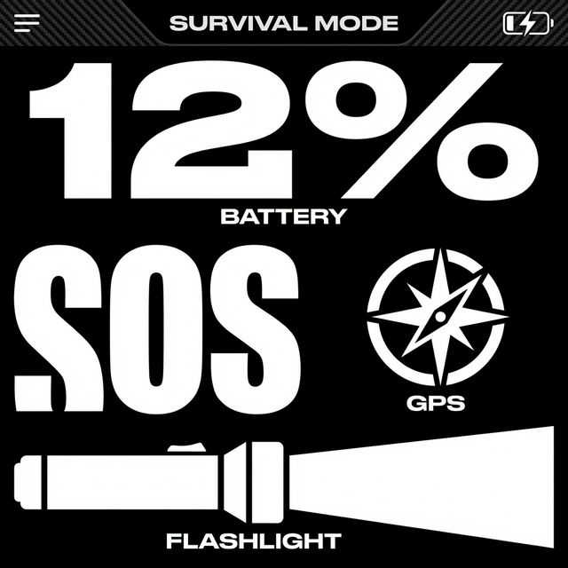
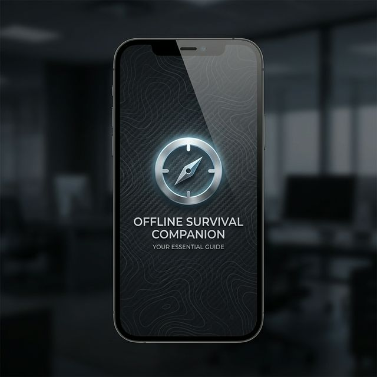
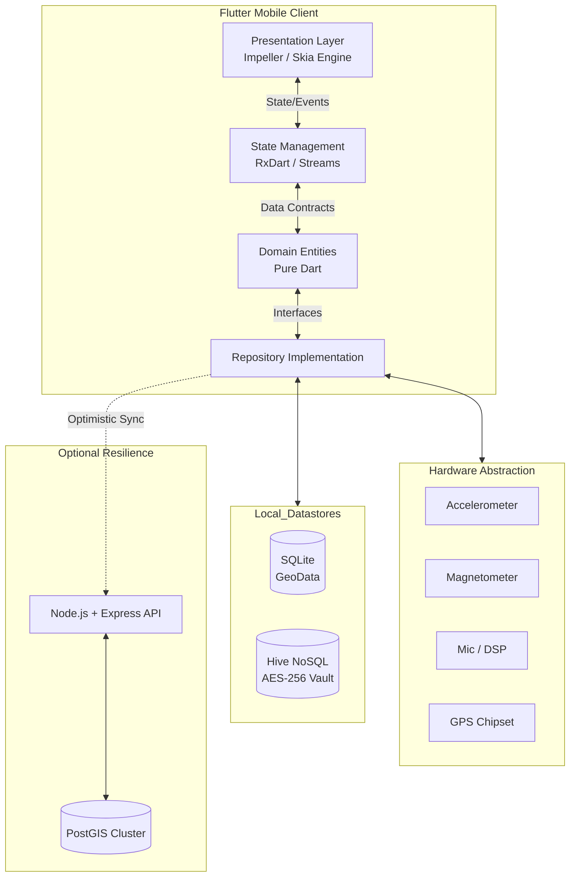

<div align="center">

<!-- Animated Typing Header -->


<!-- Capsule Banner -->


<br/>

**The Ultimate Autonomous Utility for Disconnected Environments**

[](https://github.com/rajkrish0608/Offline-Survival-Companion/actions)
[](https://github.com/rajkrish0608/Offline-Survival-Companion/releases)
[](https://opensource.org/licenses/MIT)
[](https://flutter.dev)
[](https://nodejs.org)

<br/>

<!-- Placeholder for Spline 3D Embed Preview -->
> 🌌 **[Interactive 3D Topographical Demo](https://spline.design/)** — *Spline/WebGL integration rendering real-time elevation node mapping.*

<br/>

## 🖼️ Visual Interface: Enterprise UX

<div align="center">
  <table border="0">
    <tr>
      <td width="50%" align="center">
        
        <br/><em>Survival Mode (OLED Optimized)</em>
      </td>
      <td width="50%" align="center">
        
        <br/><em>Core System Boot Sequence</em>
      </td>
    </tr>
  </table>
</div>

<br/>

<!-- Animated Product Demo GIF Placeholder -->


</div>

---

## 🚀 1. Executive-Level Project Overview

**Problem Statement:**  
Modern mobile utilities are structurally dependent on active TCP/IP connections. In high-risk scenarios (natural disasters, remote expeditions, cellular infrastructure collapse), these applications become obsolete hardware bricks exactly when they are needed most. 

**Solution Architecture:**  
The **Offline Survival Companion** reverses this paradigm. Built on an aggressive, deterministic "Offline-First" architecture, it pushes massive computation payloads—including spatial rendering, cryptographic hashing, and speech recognition—directly to the edge device. 

**Target Audience:**  
- **Disaster Response Protocols:** First responders operating in compromised physical environments.
- **Enterprise Wilderness Exploration:** Teams requiring sub-meter AR topological navigation without Assisted-GPS.
- **High-Risk Demographics:** Users requiring instantaneous, zero-latency panic hardware integrations.

**Engineering Philosophy:**  
*Resilience through autonomy.* We believe a life-saving tool must rely on physics (hardware sensors) rather than infrastructure (cell towers). 

---

## 🏛️ 2. System Architecture (Technical)

Our system is structured utilizing strict **Clean Architecture** patterns, ensuring immutability across safety protocols and preventing UI blocking operations from stalling background sensor telemetry.

### Mermaid Architecture Diagram



### Request Lifecycle & Data Flow
1. **Event Capture:** A 60Hz loop polls native sensors (e.g., Magnetometer for AR Compass).
2. **State Mutation:** The data is pushed through an Isolate (background thread) to prevent main-thread jank, piped into the BLoC.
3. **Optimistic Persistence:** If the event is a "Safety Pin" drop, it is serialized directly to SQLite via `sqflite` with a `sync_status: PENDING`.
4. **Outbox Synchronization (Eventual Consistency):** A connectivity listener detects network restoration. The outbox flushes to the Node.js API using an exponential backoff circuit breaker.

### Scalability & Fault Tolerance
- **UI Thread Preservation:** Heavy cryptographic tasks (AES-256) are executed in separated Dart Isolates.
- **Degraded Modes:** The app gracefully degrades. If GPS lock is lost, the Map engine falls back to the last known coordinate cached in Hive. If battery drops below 20%, it triggers a deterministic state machine overhaul (Survival Mode), killing complex widget trees for raw black/white text.

---

## ⚙️ 3. Technology Stack

| Category | Technology | Rationale |
| :--- | :--- | :--- |
| **Frontend Platform** | Flutter 3.x (Dart) | Predictable compilation to C++ ARM binaries; Impeller engine for 120fps capability. |
| **State Management** | `flutter_bloc` | Enterprise standard for enforced unidirectional data flow and highly testable state transitions. |
| **Relational Database** | SQLite (`sqflite`) | ACID-compliant on-device storage for dense geospatial coordinate routing. |
| **NoSQL / Secure Store** | Hive | High-performance key-value store; natively supports AES-256 encryption chunking. |
| **Backend API** | Node.js / Express | Non-blocking event loop ideal for capturing massive concurrent bursts of SOS telemetry. |
| **Cloud Database** | PostgreSQL + PostGIS | Enterprise-grade spatial query support for calculating crowd-sourced safety polygon overlapping. |
| **Hardware Abstraction**| `camera`, `speech_to_text` | Direct C++ method channels to iOS/Android underlying APIs bypassing UI thread limitations. |
| **Security** | AES-256-CBC | Hardware-backed keystore/Secure Enclave utilization for symmetric key generation. |
| **Animation / 3D** | MapLibre GL / Canvas API | OpenGL/WebGL bindings for massive vector coordinate interpolations at 60Hz. |

---

## 🛠️ 4. Feature Matrix: Comprehensive Capabilities

The **Offline Survival Companion** is structured into five core high-resilience modules. Each component is engineered to operate under zero-connectivity constraints.

### 🌍 I. Advanced Geospatial Engine
*   **Offline Vector Mapping (MapLibre GL):** High-performance, GPU-accelerated map rendering utilizing locally stored `.mbtiles` payloads.
*   **Regional Pack Management:** Granular control over map downloads, allowing users to cache specific survival zones before departure.
*   **Real-Time Route Tracking:** Deterministic path recording using local GPS telemetry; tracks are persisted to SQLite for retroactive analysis.
*   **Dynamic Survival POIs:** Automated highlighting of critical infrastructure—Hospitals, Police Stations, and Safe Havens—extracted from vector tile metadata.
*   **Topology HUD:** Dedicated topographic mode for elevation-conscious navigation in mountainous terrain.

### 🚨 II. Emergency SOS & Triage
*   **Silent SOS Protocol:** A discreet, non-vibrating trigger system that initiates emergency workflows without alerting nearby threats.
*   **Multi-Sensor Triggers:**
    *   **Shake Detection:** Background accelerometer monitoring that triggers distress signals upon high-G force events.
    *   **Voice Activation:** Local audio DSP engine (Isolate-isolated) that recognizes SOS trigger phrases (e.g., "Help Help Help") even when the app is backgrounded.
*   **Automated Remote Alerter:** Firing encrypted SMS/Network payloads to pre-configured Emergency Contacts containing sub-meter precision coordinates.
*   **High-Decibel Panic Siren:** An audio-override system that forces the device to emit a maximum-volume distress frequency to attract physical attention.

### 🛡️ III. Critical Safety & Women's Empowerment
*   **Safety Timer (The "Dead Man's Switch"):** A countdown protocol requiring periodic user confirmation. Failure to "check-in" auto-triggers a full SOS broadcast.
*   **Fake Call Simulation:** A high-fidelity UI overlay that replicates a native incoming call (with programmable caller ID) to provide a socially acceptable exit from uncomfortable environments.
*   **Helpline Directory:** A zero-database-delay directory of local and national emergency services, categorized by urgency.
*   **Self-Defense Repository:** Illustrated, offline-available guides for tactical situational awareness and physical safety.

### 🔒 IV. Secure Cryptographic Vault
*   **Government-Grade Encryption:** AES-256 implementation for all local document storage. Keys never leave the device hardware.
*   **Biometric Authentication Gate:** Multi-factor local auth requiring FaceID, TouchID, or Android Biometric Prompt APIs for entry.
*   **Offline Document Ingestion:** Scan and store vital travel docs, medical records, or identity proof without cloud upload exposure.
*   **Auto-Wipe Safety:** Programmable threshold to purge the local vault after multiple failed authentication attempts (User-configurable).

### 🧰 V. Survival Toolkit & 3D HUD
*   **AR Compass HUD:** A sensor-fusion Augmented Reality overlay. Points of Interest (POIs) and bearings are projected directly onto the camera feed using real-time geographic azimuth calculations.
*   **Signal Mirrors & Strobe:** Programmable screen/flashlight patterns including standard Morse SOS and high-frequency strobe for signaling rescue aircraft.
*   **Webpage Archiver:** A lightweight PWA-style scraper that snapshots survival guides or news for offline reading.
*   **Survival Mode Theme:** A deterministic low-power override. Automatically switches the app to a high-contrast monochrome OLED theme (pure black pixels) and disables all non-critical UI animations to preserve battery life below 20%.

---

## 🎥 5. 3D & Animation Architecture

This project treats pixel manipulation as a critical feature, particularly in high-stress UX.

### 2D Micro-Interaction Physics
We utilize Flutter's implicit animations bound to stiff spring constants ($k$) and critical damping ratios ($\zeta \approx 1$). This means buttons don't "float"—they snap, providing absolute tactile certainty to the user during panic states.

### 3D Render Pipeline (AR Compass & Maps)
- **Engine:** MapLibre GL Native.
- **Frame Lifecycle:** At 60 frames per second, the magnetometer stream updates an `Angle` state. Native C++ bindings calculate the rotation matrix and project the viewport 3D camera vector over the static 2D vector tiles.
- **GPU Acceleration & Memory:** We employ severe Level of Detail (LOD) culling. Vector tile layers not in the immediate frustum are aggressively garbage collected to keep VRAM usage strictly under 150MB.
- **Canvas AR HUD:** The Camera stream is drawn as the lowest layer on the Z-axis. Flutter's custom `CustomPainter` API natively plots geometry (Canvas draw calls) calculating relative bearing offsets in screen-space coordinates.

---

## 📦 6. Getting Started & Installation

### Local Development Setup

1. **Clone Repository & Define Environment**
```bash
git clone https://github.com/rajkrish0608/Offline-Survival-Companion.git
cd Offline-Survival-Companion/flutter_app
```

2. **Initialize Secure Environment Constraints (`.env`)**
```properties
MAP_TILE_API_KEY=sk_test_51... # (If fetching initial tiles)
SYNC_SERVER_URL=https://api.survival-edge.io/v1
AES_SALT_ROUNDS=12
DEBUG_FORCE_SURVIVAL_MODE=false
```

3. **Build Dependency Graph**
```bash
flutter clean && flutter pub get
```

4. **Launch Development Isolate**
```bash
flutter run --flavor development --dart-define=ENVIRONMENT=DEV
```

### Production Build Pipeline
For enterprise deployment, binaries must be Ahead-of-Time (AOT) compiled and obfuscated to prevent reverse-engineering of cryptographic structures.

```bash
# Android - R8 Shrinking + Obfuscation
flutter build appbundle --release --obfuscate --split-debug-info=./build/app/outputs/symbols

# iOS - LLVM Optimization
flutter build ipa --release --obfuscate --split-debug-info=./build/ios/symbols
```

---

## 📡 7. API Reference

While predominantly offline, the synchronization layer exposes a resilient REST structure.

### Add Crowdsourced Safety Pin
Synchronizes a locally stored geofence marker with the global database.

**Endpoint:** `POST /api/v1/sync/safety-pins`
**Auth:** Bearer JWT

```json
// Request Payload (Application/JSON)
{
  "device_id": "uuid-v4",
  "payload": [
    {
      "local_id": "evt_908312",
      "lat": 34.0522,
      "lng": -118.2437,
      "urgency_index": 0.85,
      "timestamp_utc": "2026-02-25T11:45:00Z"
    }
  ],
  "checksum": "sha256-hash-of-payload"
}
```

```json
// Response (202 Accepted - Queue Processed)
{
  "status": "success",
  "synced_count": 1,
  "server_timestamp": "2026-02-25T11:45:02Z"
}
```

---

## 📁 8. Architectural Folder Structure

```text
lib/
├── core/                   # Highly abstract, un-opinionated utilities.
│   ├── encryption/         # PBKDF2 / AES-256 engines.
│   └── theme/              # Deterministic visual state machines (Survival Theme).
├── data/                   # Boundary layer (DTOs and HTTP clients).
│   ├── models/             # Immutable data classes with JSON serialization.
│   └── repositories/       # Concrete implementation of abstract domains.
├── presentation/           # Ephemeral UI states. No I/O allowed here.
│   ├── bloc/               # State reducers handling all UI -> Data interaction.
│   ├── screens/            # Macro route targets.
│   └── widgets/            # Reusable, atomic render elements.
└── services/               # Hardware interaction singletons.
    ├── audio/              # OpenAL / AudioTrack DSP wrappers.
    ├── navigation/         # AR projection and GPS polling routines.
    └── safety/             # Background Isolates for accelerometer/mic listening.
```

---

## 🚀 9. Roadmap & Enterprise Scalability Vision

- **Q3 2026: Bluetooth Low Energy (BLE) Mesh Networks:** Implementing peer-to-peer data synchronization utilizing WiFi Direct / BLE to propagate hazard data locally through device hopping (Zero-infrastructure wide-area networks).
- **Q4 2026: Satellite Payload Integration:** Native C bindings for flagship IoT Satellite APIs (e.g., essentially bypassing terrestrial networks for 50-byte SOS bursts).
- **Q1 2027: Edge-Quantized Local LLMs:** Processing complex natural language distress commands locally via TFLite/CoreML, removing reliance on rudimentary regex-based dictionary triggers.

---

## 🛡️ 10. Contribution Guidelines
We strictly enforce **Conventional Commits** and require 90%+ unit test coverage for any modifications to the `core/encryption` or `services/safety` directories. Refer to `CONTRIBUTING.md` for our branch strategy and CI/CD validation hooks.

## 📄 11. License
Distributed under the MIT License. See `LICENSE` for the full legal text.

<br/>

<div align="center">
  
</div>
